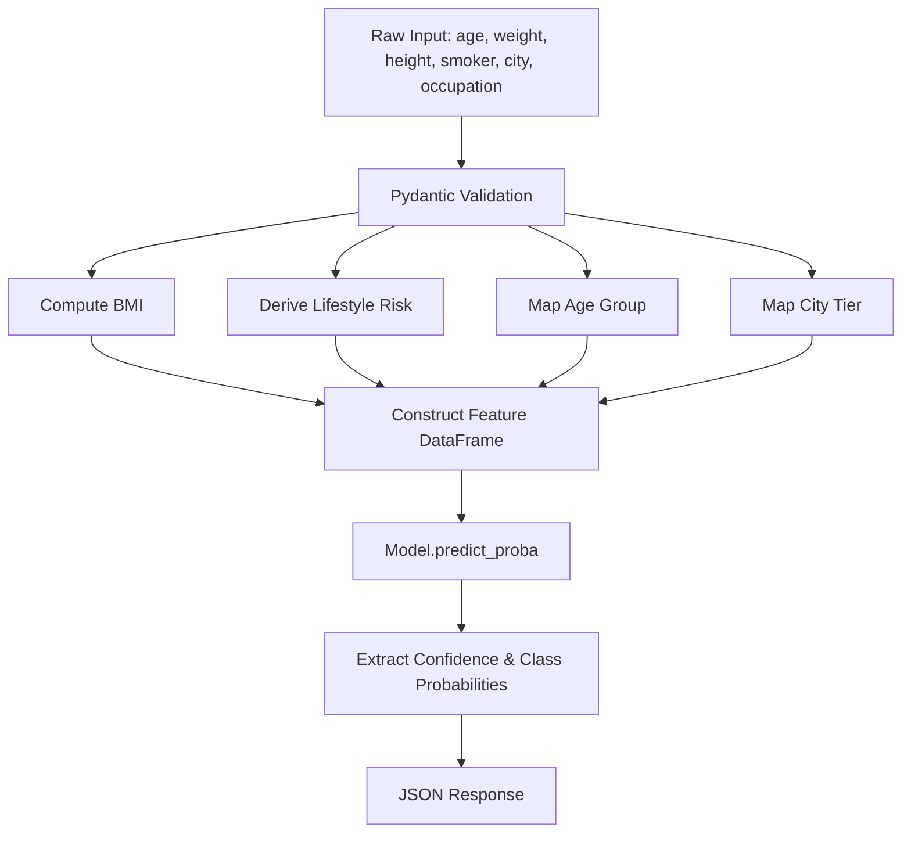

# 🏗️ InsureAI™ System Architecture & Data Flow

Detailed technical architecture documentation for **InsureAI™**, covering data transformation pipelines, ML model integration, and component communication.

---

## 1. High-Level Architecture Overview

InsureAI follows a decoupled micro-architecture combining a high-performance **FastAPI REST API**, an interactive **Streamlit Frontend Dashboard**, and a pre-trained **Scikit-Learn Machine Learning Pipeline**.

```
[ Client Browser / Web App ]
           │
           ▼
[ Streamlit UI Dashboard (Port 8501) ]
           │  (HTTP POST /predict)
           ▼
[ FastAPI Backend Server (Port 8000) ]
           │
     ┌─────┴─────────────────────────────┐
     ▼                                   ▼
[ Pydantic Feature Engineering ]   [ CORS Middleware ]
     │ (bmi, age_group, lifestyle_risk, city_tier)
     ▼
[ Random Forest Model Inference (model.pkl) ]
     │
     ▼
[ Class Probabilities & Confidence ]
```

---

## 2. Component Breakdown

### 2.1 Backend Layer (`app.py`)
- **FastAPI Engine**: Handles request routing, JSON parsing, schema validation, and error reporting.
- **Middleware**: `CORSMiddleware` enables multi-origin requests from web or mobile clients.
- **Health Verification**: Exposes `/health` to allow load balancers or frontends to poll system status.

### 2.2 Schema & Feature Engineering Layer (`schema/user_input.py`)
Pydantic v2 data models perform data sanitization and compute derived ML features automatically:

1. **BMI Feature Computation**:
   $$\text{BMI} = \frac{\text{Weight (kg)}}{\text{Height (m)}^2}$$

2. **Lifestyle Risk Categorization**:
   - `High`: $\text{Smoker} = \text{True} \land \text{BMI} > 30$
   - `Medium`: $\text{Smoker} = \text{True} \lor \text{BMI} > 27$
   - `Low`: Otherwise

3. **Age Group Encoding**:
   - `young`: $\text{Age} < 25$
   - `adult`: $25 \le \text{Age} < 45$
   - `middle_aged`: $45 \le \text{Age} < 60$
   - `senior`: $\text{Age} \ge 60$

4. **City Tier Lookup (`config/city_tier.py`)**:
   - Tier 1 Metro cities (e.g. Mumbai, Delhi, Bangalore, Chennai, Kolkata, Hyderabad, Pune).
   - Tier 2 & Tier 3 regional cities.

### 2.3 Machine Learning Layer (`model/predict.py`)
- **Model Storage**: Pre-trained Scikit-Learn `RandomForestClassifier` stored as binary pickle file (`model/model.pkl`).
- **Path Resolution**: Dynamically loads `model.pkl` relative to `__file__` to support serverless and containerized execution.
- **Inference Output**: Computes `predicted_category`, maximum `confidence` score, and explicit mapping dictionary `class_probabilities`.

---

## 3. Data Processing Pipeline



---

## 4. Frontend Architecture (`frontend.py`)
- **UI Framework**: Streamlit with injected glassmorphic dark theme CSS.
- **Visualization**: Altair Donut Chart for probability distributions.
- **Session State**: Manages quick profile presets (*Young Executive*, *High-Risk Smoker*, etc.).
- **Resilience**: Features automatic graceful degradation if backend API connection fails.
