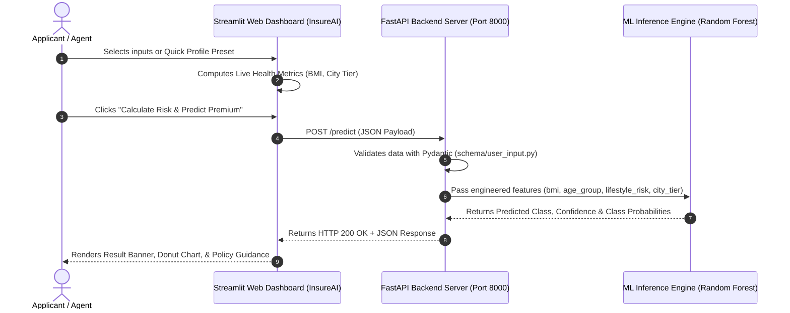

# 🛡️ Product Requirement Document (PRD)
## InsureAI™ — AI-Powered Insurance Premium Category Predictor

---

## 1. Executive Summary & Overview

### 1.1 Product Vision
**InsureAI™** is a state-of-the-art Machine Learning platform engineered to automate health and lifestyle risk profiling for health/life insurance applicants. By analyzing demographic factors, physical metrics, income data, and smoking habits, InsureAI accurately classifies applicants into **Low**, **Medium**, or **High** premium risk categories with confidence metrics.

### 1.2 Problem Statement
Traditional insurance underwriting relies on manual risk assessment workflows, leading to delays, inconsistent risk scoring, and poor customer onboarding experiences. InsureAI resolves this by delivering instant (<50ms) ML-driven risk evaluation via a user-friendly web interface and an enterprise-grade REST API.

---

## 2. Product Objectives & Business Metrics

- **Instant Risk Assessment**: Deliver real-time premium category predictions with <50ms backend latency.
- **Explainable Probability Distribution**: Provide explicit class probability breakdowns (Low, Medium, High) for full underwriting transparency.
- **Multi-Channel Access**: Offer both an interactive visual dashboard (Streamlit) and an automated REST API (FastAPI) for seamless integration with external CRM/underwriting software.
- **Zero-Friction Operations**: Single-command execution (`python run.py`) for local development and out-of-the-box Vercel serverless deployment support.

---

## 3. User Personas & Core Use Cases

### Personas
1. **Insurance Underwriter / Agent**: Needs rapid, transparent risk classification and probability metrics during applicant evaluation.
2. **Policy Applicant / Customer**: Wants an intuitive self-service portal to estimate insurance risk tier and understand key risk drivers.

### Core Use Cases
- **Self-Service Risk Estimation**: Applicant inputs physical metrics (height, weight, age) and financial data to view predicted risk category and policy recommendations.
- **Automated API Integration**: External claims or CRM platforms send JSON payloads to `/predict` to programmatically retrieve risk metrics.

---

## 4. System Architecture & Tech Stack

### 4.1 Technology Stack
- **Frontend Framework**: Streamlit (with Custom Glassmorphic Dark Theme CSS & Altair visualization engine)
- **Backend API**: FastAPI (ASGI server powered by Uvicorn)
- **Machine Learning Engine**: Scikit-Learn (Random Forest Classifier serialized via `joblib`/`pickle`)
- **Data Validation & Feature Engineering**: Pydantic v2 & Pandas
- **Visualization**: Altair & Streamlit native components
- **Deployment**: Vercel Serverless Function (`@vercel/python`), Docker

### 4.2 Architectural Diagram



---

## 5. Functional Requirements (FR)

### FR-1: Data Input & Validation Schema
The system must collect and validate the following parameters (`UserInput` schema):

| Field Name | Type | Validation Rules | Description |
| :--- | :--- | :--- | :--- |
| `age` | `Integer` | $0 < \text{age} < 120$ | Age of applicant in years |
| `weight` | `Float` | $\text{weight} > 0$ kg | Body weight in kilograms |
| `height` | `Float` | $0.5 < \text{height} < 2.5$ meters | Height in meters |
| `income_lpa` | `Float` | $\text{income} > 0$ LPA (₹) | Annual income in Lakhs Per Annum |
| `smoker` | `Boolean` | `True` / `False` | Active tobacco/smoking habit status |
| `city` | `String` | String (Title Normalized) | Residential city |
| `occupation` | `Literal` | `private_job`, `government_job`, `business_owner`, `freelancer`, `student`, `retired`, `unemployed` | Employment sector |

### FR-2: Dynamic Feature Engineering
The backend/schema layer must compute derived features automatically:
1. **BMI Computation**: $\text{BMI} = \frac{\text{weight}}{\text{height}^2}$
2. **Lifestyle Risk Factor**:
   - `High`: Smoker is `True` and $\text{BMI} > 30$
   - `Medium`: Smoker is `True` or $\text{BMI} > 27$
   - `Low`: All other cases
3. **Age Group Categorization**: `young` ($<25$), `adult` ($25-44$), `middle_aged` ($45-59$), `senior` ($\ge 60$)
4. **City Tier Lookup**: Maps cities to Tier 1 Metro (e.g. Mumbai, Delhi, Bangalore) vs Tier 2/3 cities.

### FR-3: Model Inference & Response Contract
The backend `/predict` endpoint must respond with the following contract:

```json
{
  "predicted_category": "Low",
  "confidence": 0.78,
  "class_probabilities": {
    "High": 0.02,
    "Low": 0.78,
    "Medium": 0.20
  }
}
```

### FR-4: UI Dashboard Experience
- **Header & Branding**: Custom `InsureAI PRO v1.0` navbar featuring glowing logo emblem and real-time API status badge (`🟢 API Connected`).
- **Quick Profiles**: Sidebar buttons to instantly populate preset profiles (*Young Executive*, *High-Risk Smoker*, *Fitness Enthusiast*, *Senior Citizen*).
- **Visual Analytics**: Interactive Altair Donut Chart and progress bars displaying exact class probability distribution.
- **Underwriting Guidance**: Contextual policy recommendations based on predicted category.

---

## 6. Non-Functional Requirements (NFR)

- **Performance**: Predict API response time must remain below 50ms under normal load.
- **Reliability & Port Management**: The launcher (`run.py`) must automatically detect and clear port conflicts on ports `8000` and `8501` prior to startup.
- **Cross-Origin Security (CORS)**: `CORSMiddleware` configured in FastAPI to allow multi-domain frontend requests.
- **Deployment Compatibility**: Built to run seamlessly on local environments, Docker containers, and Vercel Serverless Functions (`api/index.py` & `vercel.json`).

---

## 7. Project File Structure

```
Insurance Predictor/
├── config/
│   └── city_tier.py          # City Tier classification maps
├── model/
│   ├── model.pkl             # Serialized ML Model
│   └── predict.py            # Dynamic Model loader & predict logic
├── schema/
│   ├── prediction_response.py # Output schema contract
│   └── user_input.py         # Input validation & feature engineering
├── .gitignore                # Git ignore rules
├── Dockerfile                # Container deployment config
├── PRD.md                    # Product Requirement Document
├── README.md                 # Project Overview & Quickstart Guide
├── app.py                    # FastAPI application
├── frontend.py               # Streamlit Dashboard UI
├── logo.png                  # InsureAI Custom Logo Emblem
├── requirements.txt          # Python dependencies
├── run.py                    # Single-command concurrent runner
└── myvenv/                   # Virtual Environment
```

---

## 8. Operating Instructions

### 8.1 Local Execution (Single Command)
Run both frontend and backend concurrently:
```bash
python run.py
```

- **Streamlit Web UI**: [http://localhost:8501](http://localhost:8501)
- **FastAPI REST API**: [http://localhost:8000](http://localhost:8000)
- **Swagger Documentation**: [http://localhost:8000/docs](http://localhost:8000/docs)
